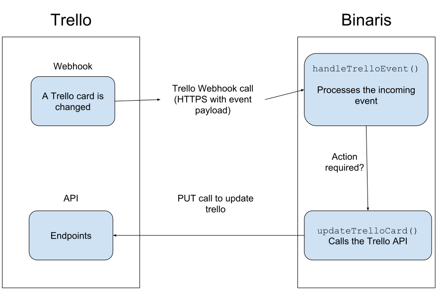

# Trello Webhook With Functions
Programmatically react to Trello events.

# What does it do?

1. Set due dates to new cards
1. Assign members to cards by the card list name
1. Mark cards as "Done" when moved to the "Done" list
1. Clear card members when when card is moved to the "Todo" list
1. ... Pretty much anything you can express in code.

Trello's [Webhooks](https://developers.trello.com/page/webhooks) are triggers that call an HTTPS endpoint whenever a Trello _Model_ (card, list or board) changes. This app serves as a backend that responds to webhook calls, and applies predefined logic on them. For example, sets a default due date for new cards, or assigns cards to board members according to their content.

# Deploy me!

First, [Get a Binaris API Key](https://binaris.com/), a [Trello API Key and Token](https://trello.com/app-key) and the [id of the board you'd like to watch](https://stackoverflow.com/a/50908600/51197).

```bash
# Install the Binaris CLI
$ npm install -g binaris

# Set your API key
$ bn login

# Clone this repo.
$ git clone https://github.com/binaris/trelloDemoApp.git
$ cd trelloDemoApp

# Install the function dependencies
$ npm install

# Set the environment variables for deployment
$ export BOARD_ID={trello-board-id}
$ export BINARIS_API_KEY={binaris-api-key}
$ export TRELLO_API_KEY={trello-api-key}
$ export TRELLO_TOKEN={trello-token}

# Deploy
$ for function in createWebhook getBoardMembers listWebhooks updateTrelloCard handleTrelloEvent;
do
    bn deploy $function;
done

# Export the URL of the handleTrelloEvent function, which ends with handleTrelloEvent.
$ export CALLBACK_URL=https://run.binaris.com/.../handleTrelloEvent

# Create a webhook
$ bn invoke createWebhook --data '{
    "idModel": "'${BOARD_ID}'",
    "description": "My first webhook!",
    "callbackURL": "'${CALLBACK_URL}'"
}'

# List your webhooks
$ bn invoke listWebhooks

{
  "webhooks": [
    {
      "id": "<Generated by Trello>",
      "description": "My first webhook!",
      "idModel": "<Your board id>",
      "callbackURL": "https://run.binaris.com/.../handleTrelloEvent",
      "active": true
    }
  ]
}

# That's it! Let's read the logs to see what's happening
$ bn logs handleTrelloEvent --since 1m --tail

# Read the code in functions/handleTrelloEvent.js to follow flow.
 ```
# How does it work?


# Why Serverless? Why Binaris?
With classic server architecture, you had to provision and maintain a designated server to handle the webhook calls. If it's   mission-critical, you'd probably need numerous servers in HA constellation and a scale mechanism to handle bursts. You will take care of your infrastructure - from operating system updates and HTTPS certificates to npm vulnerabilities. The server is probably going to be almost 100% idle, but you are going to pay its full price.

With Function as a Service platform, you only handle code, and never pay for idle. All the infrastructure - from operating system to scaling - is done for you.

[Binaris](https://binaris.com/) is a Function as a Service platform with an extremely fast function invocation. This means that you can break your code to multiple functions based on scale, permission and engineering considerations, while keeping the backend quick and responsive. 
