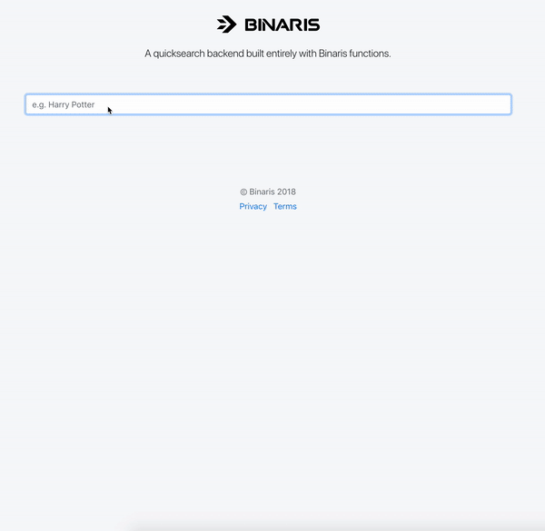

# Quicksearch With Functions
Fetch textual results as you type with function-based quicksearch.



# What does it do?
1. Index textual data in Redis by uploading JSON to a function endpoint.
1. Super-fast search for textual terms by calling a function endpoint.

# Deploy me!

[Get a Binaris API Key](https://binaris.com/) and a managed Redis instance (which is free from [Redis Labs](www.redislabs.com)).

```bash
# Install the Binaris CLI
$ npm install -g binaris

# Set your API key
$ bn login

# Clone this repo.
$ git clone git@github.com:binaris/functions-examples.git
$ cd quicksearch

# Install the function dependencies
$ npm install

# Set the environment variables for deployment
$ export BINARIS_API_KEY={binaris-api-key}
$ export REDIS_HOST={your-redis-host}
$ export REDIS_HOST={your-redis-port}
$ export REDIS_PASSWORD={your-redis-password}

# Deploy the function
$ bn deploy update
$ bn deploy search

# Index some sample data
$ bn invoke update -j test/data_1.json

# Open the webpage at the browser, with the API key as a query string argument
index.html?apiKey=<api-key-here>
```

# Why Serverless? Why Binaris?
With classic server architecture, you had to provision and maintain a designated server to handle the webhook calls. If it's   mission-critical, you'd probably need numerous servers in HA constellation and a scale mechanism to handle bursts. You will take care of your infrastructure - from operating system updates and HTTPS certificates to npm vulnerabilities. The server is probably going to be almost 100% idle, but you are going to pay its full price.

With Function as a Service platform, you only handle code, and never pay for idle. All the infrastructure - from operating system to scaling - is done for you.

[Binaris](https://binaris.com/) is a Function as a Service platform with an extremely fast function invocation. This means that you can break your code to multiple functions based on scale, permission and engineering considerations, while keeping the backend quick and responsive. 
