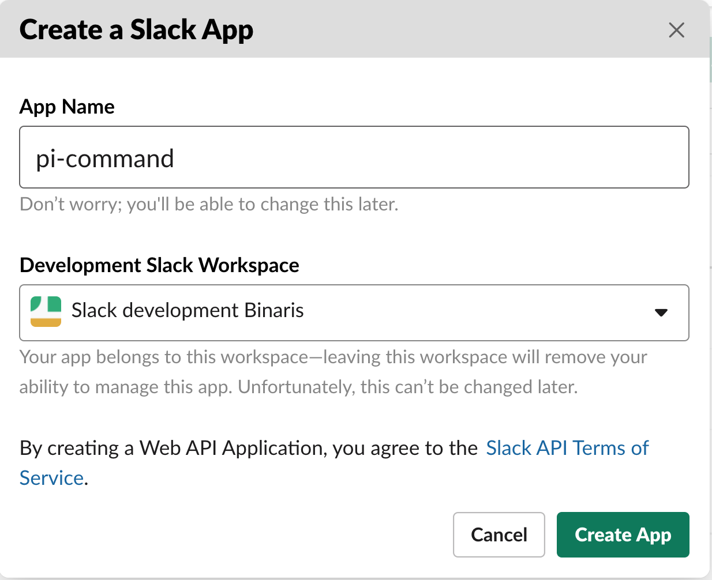
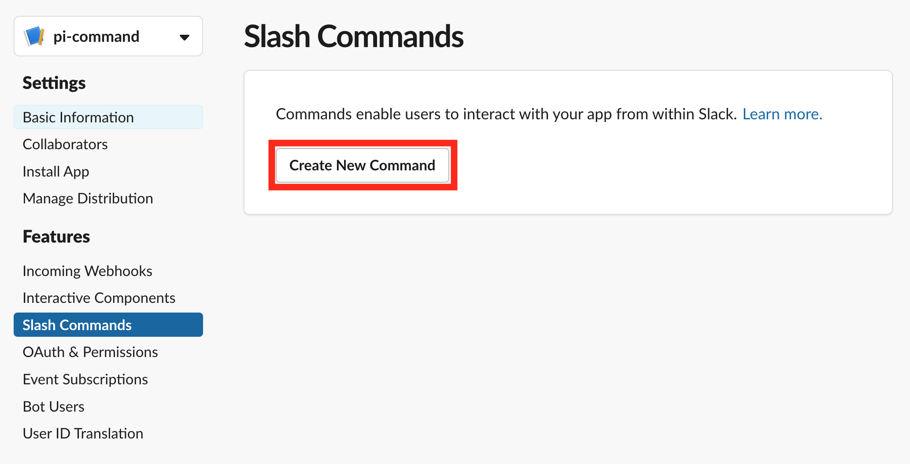
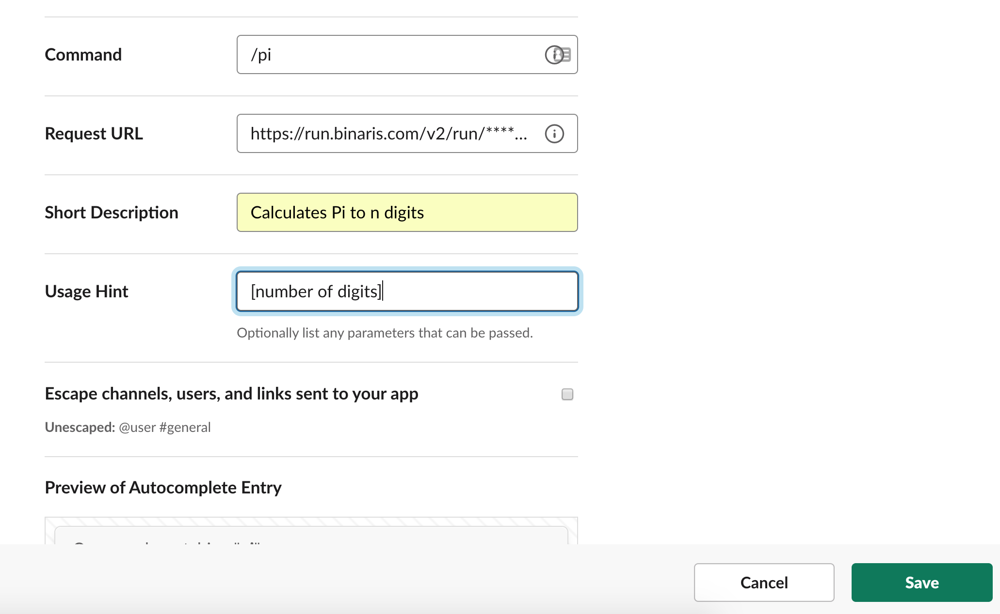
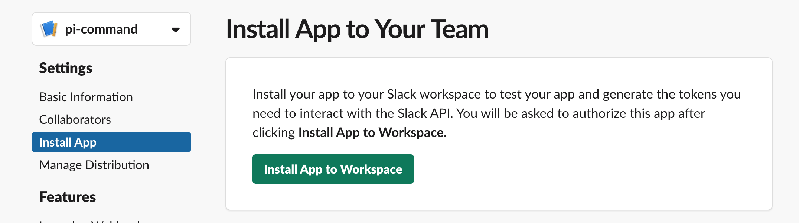

# Slack π command (NodeJS)

A slack command that returns π to _n_ digits, via a Binaris function.


### Table of Contents
1. [Return _n_ digits of π with a Binaris Function](#calculate-pi)
1. [Integrate with Slack](#integrate-slack)

<a name="calculate-pi"></a>

## Return _n_ digits of π with a Binaris Function

It is assumed you already have a Binaris account. If you don't have an account yet, worry not, signing up is painless and takes just 2 minutes. Visit [Getting Started](https://dev.binaris.com/tutorials/nodejs/getting-started/) to find concise instructions for the process.

We'll start by creating the skeleton for our π function.

```bash
bn create node8 public_slack_pi_command
```

It's important the function name begin with `public_`, this indicates to the Binaris backend that the function should be publicly accessible.

The first change we'll make, is to parse and convert the input payload Slack sends into something usable. Slack sends command payloads as `x-url-form-encoded` which means we'll need to convert it into a native JavaScript object. Luckily the `query-string` package from `npm` can do a lot of our heavy lifting for us.

> Note: Binaris will attempt to `JSON.parse` any incoming payloads, successfully parsed payloads reside in the `body` field.

```diff
+const { parse } = require('query-string');

 exports.handler = async (body, context) => {
+  const parsed = parse(context.body.toString('utf8'));
-  const name = context.request.query.name || body.name || 'World';
-  return `Hello ${name}!`;
 };
```

Now that we have the payload in a usable form, let's extract the data we need, so we compute π to the number of digits requested from our user.

```diff
   const parsed = parse(context.body.toString('utf8'));
+  const numDigits = parseInt(parsed.text, 10);
 };
```

Now let's add some generic validation

```diff
   const numDigits = parseInt(parsed.text, 10);
+
+  // ensure the input is a valid, real number
+  if (!numDigits || isNaN(numDigits)) {
+    return {
+      text: `Expected integer param, received ${typeof(numDigits)}`,
+      response_type: 'ephemeral',
+    };
+  }

+  // enforce a fun limit on the max pi digits
+  if (numDigits > 10) {
+    return {
+      text: "You've already had too much 🥧!",
+      response_type: 'ephemeral',
+    };
+  }
 };
```

> Note: We return the specific fields `text` & `response_type` because this is the expected format of an "Error" response in the Slack API.

All that's left to do is return π to the number of digits requested by the user. The `npm` package `pi` makes this very convenient.


```diff
   }
+  return PI(numDigits - 1);
};

```

> Note: We subtract one from the input value because the first 3 in π is not considered a "digit"

Don't forget to `require` the package at the top

```diff
 const { parse } = require('query-string');
+const PI = require('pi');

 exports.handler = async (body, context) => {
```

The final state of `function.js`

```JavaScript
const { parse } = require('query-string');
const PI = require('pi');

exports.handler = async (body, context) => {
  // slack unfortunately sends command payloads as x-url-form-encoded
  const parsed = parse(context.body.toString('utf8'));

  // ensure the input is a valid, real number
  const numDigits = parseInt(parsed.text, 10);
  if (!numDigits || isNaN(numDigits)) {
    return {
      text: `Expected integer param, received ${typeof(numDigits)}`,
      response_type: 'ephemeral',
    };
  }

  // enforce a fun limit on the max pi digits
  if (numDigits > 10) {
    return {
      text: "You've already had too much 🥧!",
      response_type: 'ephemeral',
    };
  }
  return PI(numDigits - 1);
};
```

As a final step, we need to deploy the function so it's invokable on the Binaris backend. We also used some dependencies, so we'll also install those now.

```bash
$ npm install query-string pi
$ bn deploy public_slack_pi_command
```

Make sure to copy and save the URL printed by `bn deploy`, we will use this URL during the next step

```bash
# example URL
https://run.binaris.com/v2/run/0123456789/public_slack_pi_command
```

<a name="integrate-slack"></a>

## Integrate with Slack

1. Create a new app on Slack or have your administrator do it for you.
  
    https://api.slack.com/apps?new_app=1

    

    I chose to call the app "pi-command" but this is entirely preference

    

1. Once your Slack app has been created, navigate to "Slash Commands" on the sidebar

    

   After being clicked, a prompt will open. Feel free to fill in the fields as you see fit. The only field which is non-negotiable is "Request URL". That field needs to contain the URL printed by `bn deploy` at the end of the last section

    

1. As our final step we need to install our app to the workspace, this allows our command to be called.

    


To test your new command, navigate to slack and try it out

```
/pi 5

3.1415
```